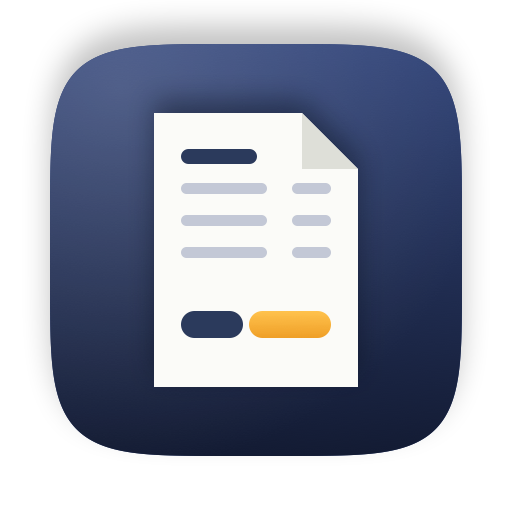
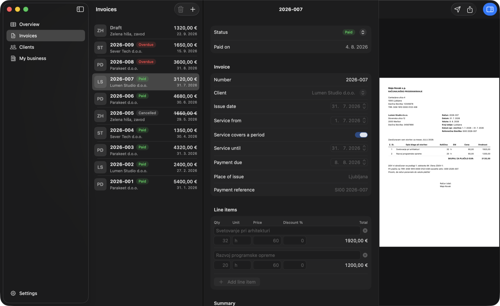
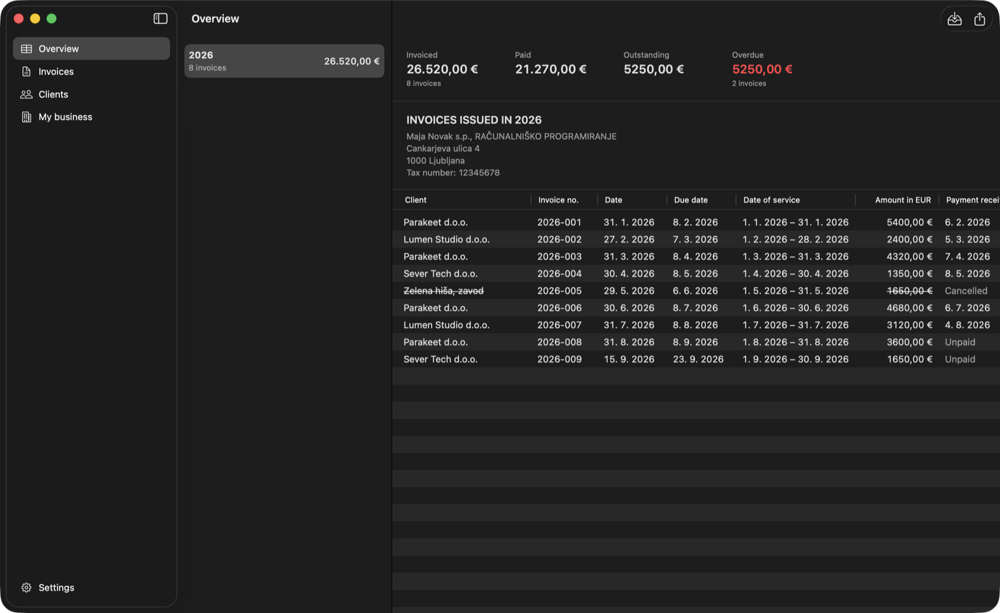
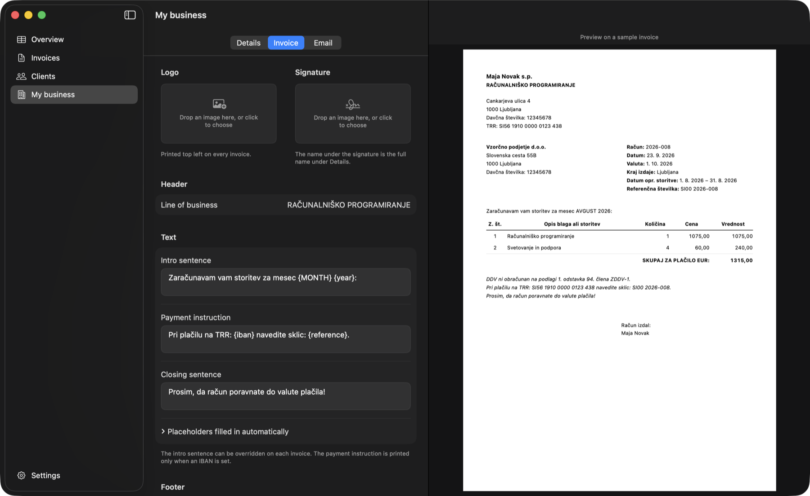

<div align="center">



# Invoices

A native Mac app for issuing and tracking invoices as a Slovenian sole trader.

[](https://github.com/perkzen/invoices/actions/workflows/ci.yml)
[](https://github.com/perkzen/invoices/releases/latest)


</div>



## Features

- **Invoices** — drafts with line items and live totals; issuing numbers them and locks them
- **PDF** — an A4 invoice with every field Slovenian law requires, previewed as you type
- **Email** — opens the invoice as a new message in Apple Mail or Gmail, with the PDF ready to send
- **Year overview** — invoiced, paid, outstanding and overdue, exported to Excel for the accountant
- **Import** — brings in past invoices from a spreadsheet
- **Private mode** — ⇧⌘H hides amounts and tax numbers for screen sharing
- **Two languages** — the interface in English or Slovenian; documents always in Slovenian
- **Command line** — `invoices` works on the same data, and comes with a skill for Claude Code

<table>
  <tr>
    <td></td>
    <td></td>
  </tr>
</table>

## Install

Download the DMG from [the latest release](https://github.com/perkzen/invoices/releases/latest)
and drag Invoices into Applications. The app updates itself from then on.

It is not notarized, so macOS blocks the first launch: open **System Settings › Privacy &
Security** and choose **Open Anyway**.

For the command-line tool, choose **Invoices › Install Command Line Tool…** or the button in Settings.

## Building

Needs macOS 26, Xcode 26 and [XcodeGen](https://github.com/yonaskolb/XcodeGen).

```bash
brew install xcodegen
xcodegen generate
xcodebuild -project Invoices.xcodeproj -scheme Invoices -destination 'platform=macOS' -derivedDataPath build test
```

Debug builds a separate **Invoices Dev** app with its own data, so development never
touches real invoices.

## Documentation

- [Features in detail](docs/features.md)
- [The command-line tool](docs/cli.md)
- [Architecture and decisions](docs/architecture.md)
- [Releasing](docs/releasing.md)
